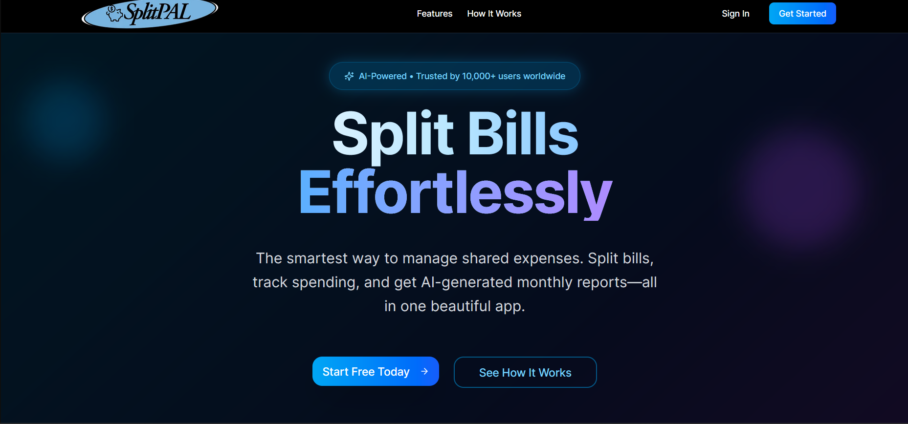
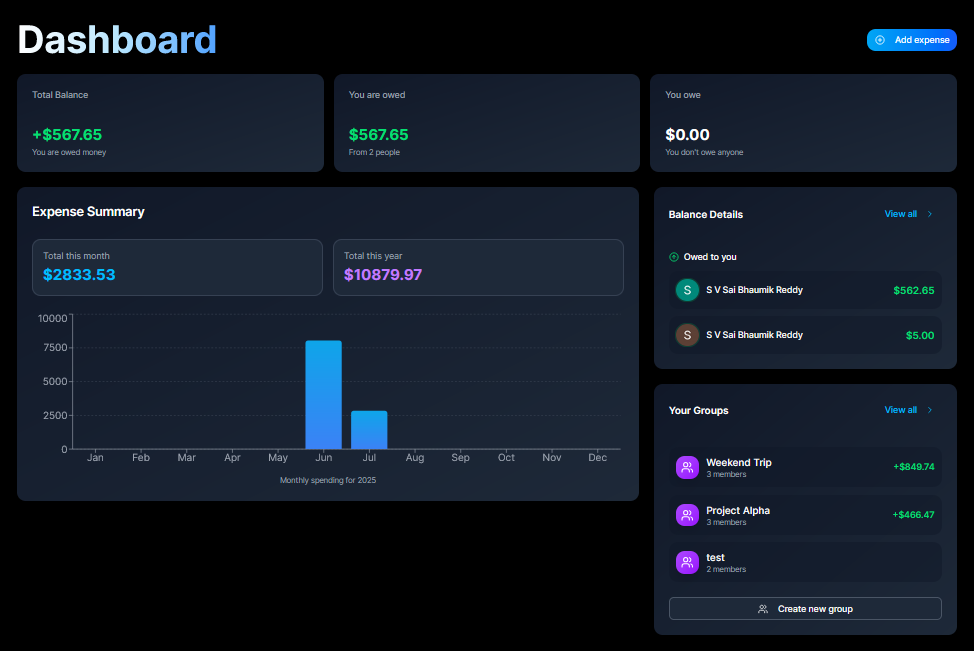
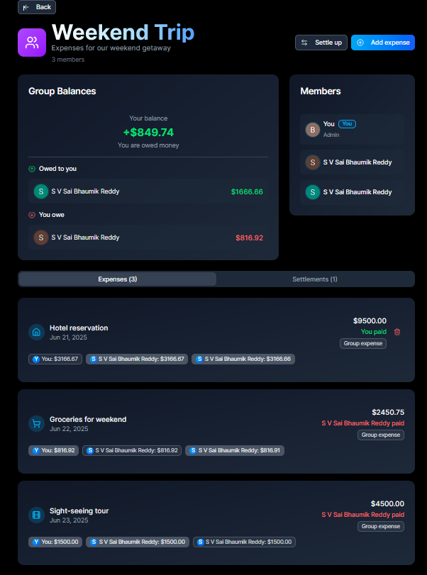
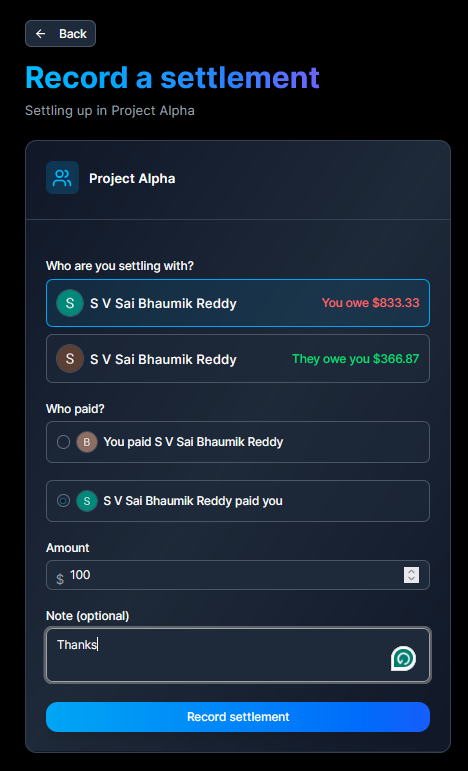

# 💸 SplitPAL

SplitPAL is a full-stack expense tracker and bill-splitting app designed for seamless group finance management. With real-time syncing, AI-generated financial tips, and a clean UI, SplitPAL simplifies the way you manage and share expenses.

[🌐 Live Demo](https://splitpal.vercel.app)

---

## Features

- Clean and modern landing page with responsive design
- User authentication and authorization using Clerk
- Real-time backend using Convex for seamless data syncing
- Dashboard to:
  - Track monthly expenses
  - Create and manage group or one-on-one expense splits
  - View and settle outstanding balances
- Scheduled task automation using Inngest:
  - Daily reminders for unsettled expenses
  - Monthly expense summaries and financial tips
- AI-powered tips and reports generated using Google Gemini API
- Consistent dark theme with shades of blue for an engaging user experience

---
## Tech Stack


| Layer             | Technology                        |
|------------------|-----------------------------------|
| Frontend         | Next.js, Tailwind CSS             |
| Authentication   | Clerk                             |
| Backend & DB     | Convex                            |
| Task Scheduling  | Inngest                           |
| AI Integration   | Google Gemini API                 |
| Deployment       | Vercel                            |
| Version Control  | Git, GitHub                       |

---
## Getting Started

### 1. Clone the Repository

```bash
git clone https://github.com/BhaumikReddy/splitpal.git
cd splitpal
```
### 2. Install Dependencies
```bash
npm install
```
### 3. Environment variables
Create a `.env.local` file and add the following:
```env
CLERK_PUBLISHABLE_KEY=your_clerk_publishable_key
CLERK_SECRET_KEY=your_clerk_secret_key
CONVEX_DEPLOYMENT_URL=your_convex_url
GOOGLE_API_KEY=your_google_api_key
INNGEST_EVENT_KEY=your_inngest_event_key
```
### 4. Run the Application
```bash
npm run dev
```
The application will be available at `http://localhost:3000`  

---
## AI Integration

SplitPAL leverages Google Gemini API to generate personalized monthly expense summaries and practical financial tips. These are delivered via automated tasks using Inngest.
## Learning Outcomes

- Built a production-ready full-stack web application using modern technologies
- Implemented real-time data syncing and user authentication with Clerk and Convex
- Integrated AI capabilities (Google Gemini API) for generating financial insights
- Scheduled and triggered background tasks using Inngest
- Applied responsive design principles and consistent theming with Tailwind CSS
- Gained experience with cloud deployment using Vercel
- Focused on delivering user-centric features like reminders, reports, and dashboard analytics
---
## Screenshots


---

---

---

---
